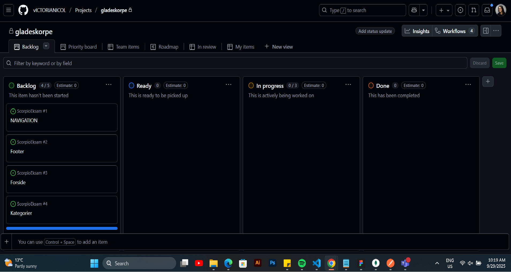
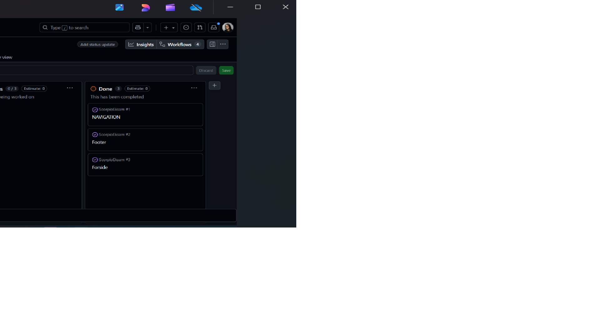
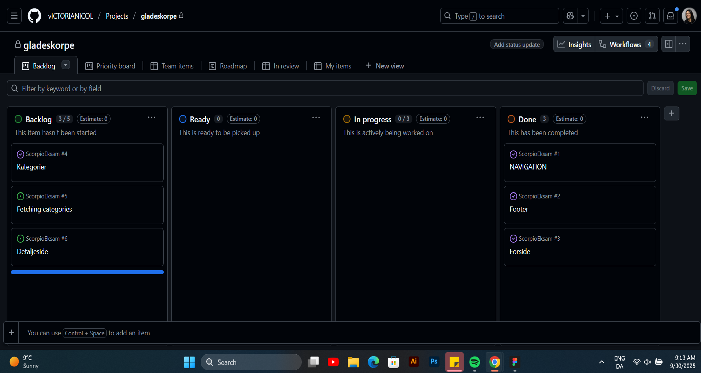
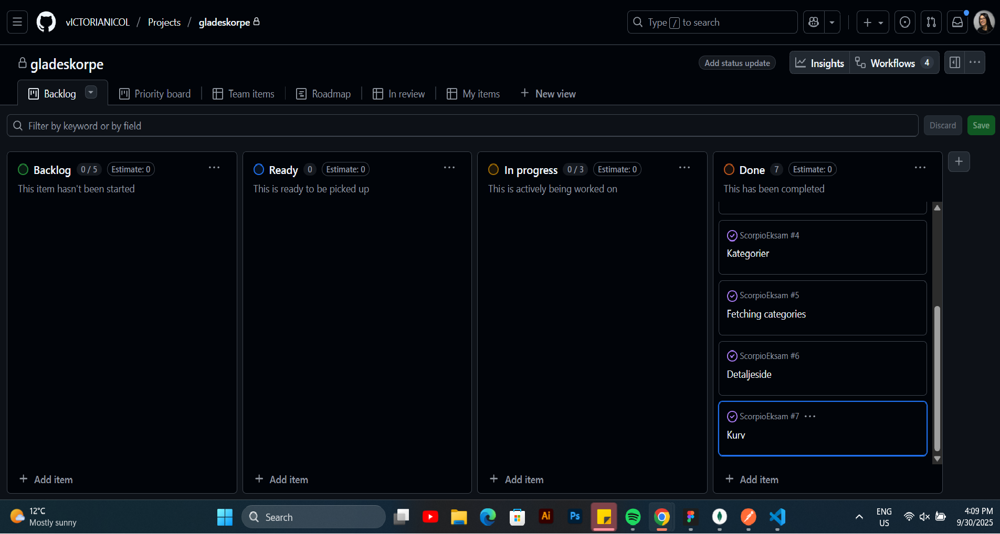
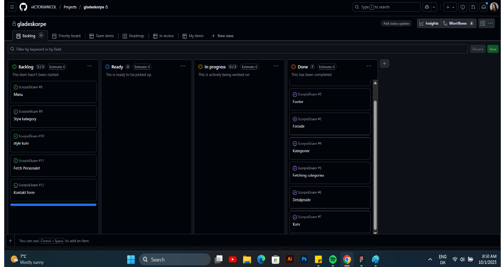
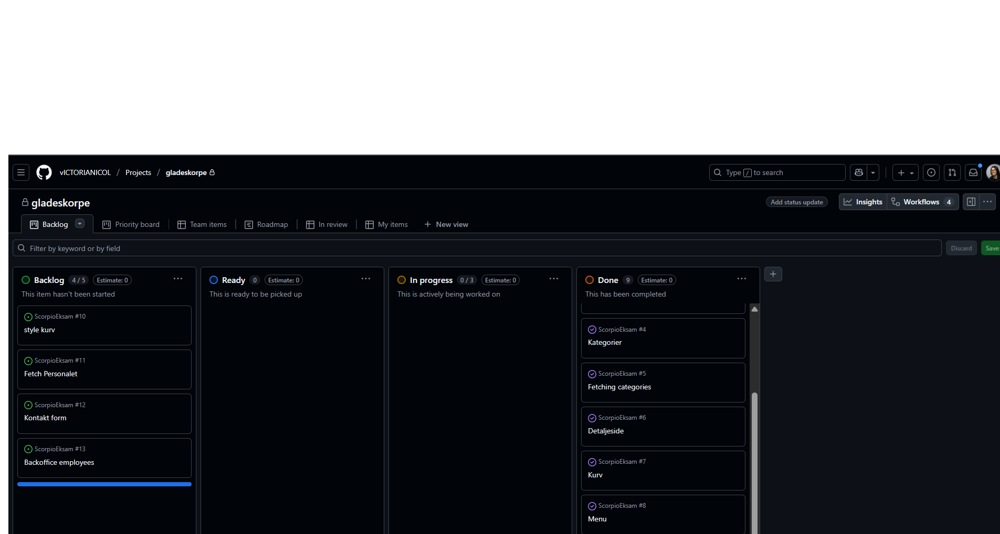
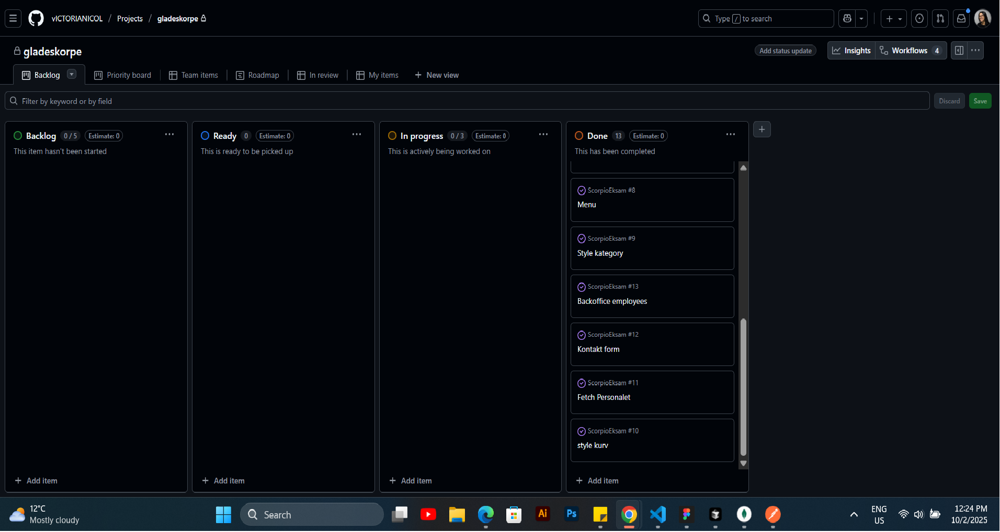

DEN GLADE SCORPE 

Victoria Nicolenco

GitHub: https://github.com/vICTORIANICOL/ScorpioEksam.git
Hold WebH124-2 

Reflection on My Project Work
For this project, I built a web application using React, focusing on creating a dynamic and interactive user interface. I structured the application with reusable components and managed state efficiently using React hooks. For styling, I utilized CSS modules to ensure modular, maintainable, and responsive designs. My workflow was tracked and organized through GitHub, allowing me to monitor progress and maintain version control.
I planned my tasks carefully and largely followed my timeline. I prioritized functionality that impacted the user experience most, such as managing employees in the BackOffice, handling the shopping cart, and submitting orders. I made sure that the core UI elements align with the intended design.
Functionally, I implemented CRUD operations for employees and ensured that actions like adding, editing, and deleting are reflected immediately in the UI. In the shopping flow, I implemented cart management, quantity adjustments, and a clear mechanism to handle completed orders. These features required integrating frontend state management with asynchronous API calls.
I faced a few challenges along the way. For example, I initially struggled with clearing the cart after an order, but I resolved this by introducing a centralized function to reset the cart state. I also enhanced the project by implementing category selection and filtering dishes dynamically, which added an extra layer of interactivity to the application.
While some advanced features were deprioritized due to time constraints, I focused on demonstrating state management, API interaction. The project showcases my ability to build a structured React application, handle dynamic data efficiently, and create a user-friendly experience.
Overall, I feel this project reflects my practical skills in React development, problem-solving under time constraints, and attention to both functionality and design quality.

Explanation of Code Elements
I have used React as the framework for building my project, focusing on reusable and modular components to structure the application efficiently.

For forms, I implemented custom state handling using React’s useState and controlled inputs to manage user input and form submissions.

I used the fetch API to communicate with the backend for creating, reading, updating, and deleting data, ensuring the UI updates dynamically.

I used React Icons to add visual elements such as buttons and interactive icons, improving the user experience.

Styling is handled using CSS modules for component-specific styles and a base CSS file (base.css) where I defined variables in :root for consistent colors, typography, and spacing throughout the application. This allows for easy theming and a unified design across pages.

Speaking Version
In my project, I would like to focus on:
The Category selection and filtering of dishes. I implemented a system where users can select a category, and only the dishes belonging to that category are displayed. I handled this by managing state in React, using useState and passing down props between components. This allowed the interface to update immediately when a category is selected.

The second feature is the Shopping cart and order form. Users can add multiple items to the cart, change quantities, and submit an order. I implemented the cart using a custom React context, storing the items in local storage so the cart persists across sessions. I also added functionality to remove items individually or clear the entire cart, giving users full control over their orders.

# Ugeplan
Arbejdstiden er mandag-fredag kl. 8:00-15:00

## Mandagsplan

## Mandagsresultat

## Tirsdagsplan

## Tirsdagsresultat

## Onsdagsplan

## Onsdagsresultat

## Torsdagsplan

## Torsdagsresultat

